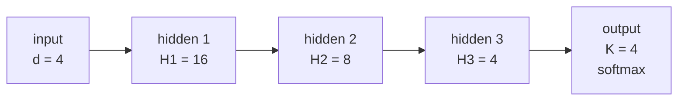

# MLP From Scratch in C

A multi-layer perceptron written from scratch in plain C — no frameworks, no linear-algebra
library, nothing beyond `libm`. Forward pass, backpropagation, and gradient descent are all
implemented by hand.

Built for the **Computational Intelligence** course project (University of Crete, 2023–24).

> **Note on status:** this is an early, work-in-progress snapshot (December 2023) kept for
> reference. It builds and runs, but training does not converge — see
> [Known issues](#known-issues). The finished version of this assignment, which also adds a
> K-means implementation, lives in [`../Simple-Dense-Network`](../Simple-Dense-Network).

## The task

Classify 2-D points into 4 classes. The class boundaries are deliberately non-linear, so a
linear model cannot solve them:

- Four circles of radius `sqrt(0.2)` are centred at `(±0.5, ±0.5)`.
- Each circle is split by the vertical line through its own centre:
  the **right** half is **class 1**, the **left** half is **class 2**.
- Everything outside the circles is **class 3** if `x1 > 0`, and **class 4** if `x1 < 0`.

Labels are one-hot encoded before training.

## Datasets

Both files are plain text, one sample per line, formatted as `x1 x2 label`:

```
0.148298 0.424656 2
-0.406650 -0.301660 1
-0.638104 -0.250191 2
```

| File | Samples | Region | Class distribution |
| --- | --- | --- | --- |
| `train_data.txt` | 8000 | uniform over `[-1, 1]²` | 2571 / 2398 / 1515 / 1516 |
| `test_data.txt` | 1200 | clustered over `[0, 2]²` | 41 / 119 / 1040 / 0 |

Both files are committed, so results are reproducible. If either is missing, `mlp` regenerates
both on startup via `create_and_save_data()` in [`data.c`](data.c).

Note that the test set is drawn from a different region than the training set (`[0, 2]²` rather
than `[-1, 1]²`), so it contains no class-4 points at all. This is inherited from the assignment
spec and is worth keeping in mind when reading any accuracy number.

## Architecture



Three hidden layers, fully connected, followed by a softmax output layer.

| Hyperparameter | Value | Defined in |
| --- | --- | --- |
| Input dimension `d` | 4 | `nn_architecture.h` |
| Hidden layers `H1, H2, H3` | 16, 8, 4 | `nn_architecture.h` |
| Output classes `K` | 4 | `nn_architecture.h` |
| Batch size `B` | 1 (pure SGD) | `nn_architecture.h` |
| Activation | `tanh` (`LOGISTIC` and `RELU` also available) | `nn_architecture.h` |
| Learning rate | 0.001 | `nn_architecture.h` |
| Epochs | 700 | `mlp.c` |
| Termination threshold | 1e-4 on the epoch-to-epoch error change | `nn_architecture.h` |

Loss is categorical cross-entropy. Switch the activation by changing one line:

```c
#define ACTIVATION_FUNCTION TANH   /* or LOGISTIC, or RELU */
```

## Build and run

Requires only a C compiler and `make`.

```bash
make        # build ./mlp
make run    # build and run
make clean  # remove the binary
```

Or without `make`:

```bash
gcc -Wall -O2 -o mlp mlp.c -lm
./mlp
```

`mlp.c` `#include`s `data.c` and `nn_architecture.c` directly, so the program is a single
translation unit — there are no separate object files to link.

The program loads (or generates) the datasets, one-hot encodes the labels, initialises the
weights, trains, and finally reports accuracy on the test set.

## Repository layout

| File | Purpose |
| --- | --- |
| [`mlp.c`](mlp.c) | Entry point — loads data, wires up the model, trains, evaluates |
| [`nn_architecture.h`](nn_architecture.h) | `MLP` struct, layer sizes, all hyperparameters |
| [`nn_architecture.c`](nn_architecture.c) | Activations, softmax, init, forward pass, backprop, gradient descent |
| [`data.h`](data.h) | `Data` struct and dataset constants |
| [`data.c`](data.c) | Dataset generation, labelling, one-hot encoding, file I/O |
| [`check.ipynb`](check.ipynb) | Scatter plots of both datasets, plus a scikit-learn `MLPClassifier` baseline |
| `train_data.txt`, `test_data.txt` | The generated datasets |

### The notebook

[`check.ipynb`](check.ipynb) is a sanity-check companion, not part of the C program. It plots
the training and test sets to confirm the class regions look right, then trains a scikit-learn
`MLPClassifier` (SGD, batch size 1, 700 iterations) on the same data as a reference point.

```bash
pip install matplotlib numpy scikit-learn
jupyter notebook check.ipynb
```

## Known issues

This snapshot predates the debugging pass. Recorded here so the state of the code is clear:

- **`softmax()` is incomplete.** It finds the max but never computes the exponentials, then
  divides by `sum`, which is still `0.0`. Every output becomes `NaN` on the first sample, and
  training produces no useful gradients.
- **`d` is 4, but the inputs are 2-D.** The input layer reads four values per sample while
  `x_train` is packed two floats per sample, so the forward pass strides past each sample.
- **Bias arrays are indexed with the wrong loop bounds.** In `initializeMLP()` and `backprop()`,
  `bias2` is written with an `H1` bound, `bias3` with an `H2` bound, and the hidden-layer-2
  update writes to `bias1` instead of `bias2` — out-of-bounds writes that `gcc -Wall` flags as
  undefined behaviour.
- **Bias is added after the activation** (`activate(z) + b`) rather than inside it
  (`activate(z + b)`).
- **`derivative()` re-applies `tanh`** to values that have already been activated, so the
  `tanh` derivative is computed on the wrong quantity.
- **The evaluation loop ignores its index.** It calls `forward_pass(x_test, ...)` with the same
  base pointer on every iteration, so it scores sample 0 a thousand times over.
- **`sleep(1)` per epoch.** A full 700-epoch run spends roughly 12 minutes doing nothing.

All of these are addressed in [`../Simple-Dense-Network`](../Simple-Dense-Network), which uses
`d = 2`, ReLU, mini-batches of 10, and gradient clipping.
