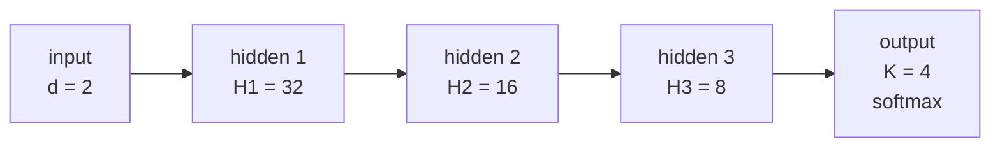

# Simple Dense Network

Two classic algorithms written from scratch in plain C — no frameworks, no linear-algebra
library, nothing beyond `libm`:

- **`mlp`** — a multi-layer perceptron with hand-written forward pass, backpropagation, and
  mini-batch gradient descent, for 4-class classification of 2-D points.
- **`kmeans`** — K-means clustering over a second, deliberately clustered dataset.

Built for the **Computational Intelligence** course project (University of Crete, 2023–24).

## Build and run

Requires only a C compiler and `make`.

```bash
make          # builds both ./mlp and ./kmeans
./mlp
./kmeans
make clean    # removes the binaries and the generated datasets
```

Both programs generate their dataset on first run if the corresponding `.txt` file is missing,
so there is nothing to download.

## Part 1 — Multi-layer perceptron

### The task

Classify 2-D points into 4 classes, with deliberately non-linear boundaries so a linear model
cannot solve them:

- Four circles of radius `sqrt(0.2)` centred at `(±0.5, ±0.5)`.
- Each circle is split by the vertical line through its own centre: the **right** half is
  **class 1**, the **left** half is **class 2**.
- Outside the circles, points are **class 3** if `x1 > 0` and **class 4** if `x1 < 0`.

8000 points are drawn uniformly from `[-1, 1]²`, labelled by the rule above, one-hot encoded,
and split 80/20 into **6400 training** and **1600 test** samples.

### Architecture



| Hyperparameter | Value | Defined in |
| --- | --- | --- |
| Input dimension `d` | 2 | `nn_architecture.h` |
| Hidden layers `H1, H2, H3` | 32, 16, 8 | `nn_architecture.h` |
| Output classes `K` | 4 | `nn_architecture.h` |
| Batch size `B` | 10 | `nn_architecture.h` |
| Activation | `RELU` (`TANH` and `LOGISTIC` also available) | `nn_architecture.h` |
| Learning rate | 0.0001 | `nn_architecture.h` |
| Max epochs | 1000 | `nn_architecture.h` |
| Train/test split | 80% | `nn_architecture.h` |
| Termination threshold | 1e-5 on the epoch-to-epoch error change | `nn_architecture.h` |

Loss is categorical cross-entropy. Switch the activation by changing one line:

```c
#define ACTIVATION_FUNCTION RELU   /* or TANH, or LOGISTIC */
```

### Implementation notes

- **Numerically stable softmax** — the maximum logit is subtracted before exponentiating, so
  large activations cannot overflow to `inf`.
- **Gradient clipping** — `calculate_norm()` and `clip_gradients()` rescale gradients whose
  L2 norm exceeds a threshold, which keeps ReLU from blowing the weights up early in training.
- **Early termination** — training stops once the epoch-to-epoch change in total error falls
  below `TERMINATION_THRESHOLD`, rather than always running the full 1000 epochs.

## Part 2 — K-means

`kmeans.c` clusters a separate 1200-point dataset built from overlapping blobs across `[0, 2]²`,
so the cluster structure is real but the boundaries are ambiguous.

| Parameter | Value |
| --- | --- |
| Clusters `M` | 9 |
| Iterations | 1500 |
| Distance | Euclidean |

Centroids are initialised by sampling actual data points, then updated incrementally as points
are assigned. The program prints the final centroids, the per-cluster error (sum of distances
from each point to its centroid), and the total clustering error.

Sample run:

```
Final Cluster Centroids:
Cluster 1 Centroid: (1.757528, 1.861082)
Cluster 2 Centroid: (1.763565, 1.097378)
...
Total Error of Clustering: 298.039482
```

Because the centroids are seeded randomly, the exact clusters and total error differ between
runs — re-running is a reasonable way to see how sensitive K-means is to initialisation.

## Repository layout

| File | Purpose |
| --- | --- |
| [`mlp.c`](mlp.c) | MLP entry point — loads data, splits, trains, evaluates |
| [`kmeans.c`](kmeans.c) | K-means entry point — clustering, centroid updates, error reporting |
| [`nn_architecture.h`](nn_architecture.h) | `MLP` struct, layer sizes, all hyperparameters |
| [`nn_architecture.c`](nn_architecture.c) | Activations, softmax, init, forward pass, backprop, gradient descent, gradient clipping |
| [`data.h`](data.h) | `MLP_Data` / `kmeans_Data` structs and dataset constants |
| [`data.c`](data.c) | Dataset generation, labelling, one-hot encoding, file I/O for both programs |
| [`exercise_1.ipynb`](exercise_1.ipynb) | Visualises the MLP dataset and its class regions |
| [`exercise_2.ipynb`](exercise_2.ipynb) | Visualises the K-means dataset and clustering results |
| [`Makefile`](Makefile) | Builds both binaries |
| [`com_int.yml`](com_int.yml) | Conda environment for the notebooks |

Note that `mlp.c` and `kmeans.c` each `#include` `data.c` directly, so both are single
translation units — there are no separate object files to link.

### Notebooks

The two notebooks are visual sanity checks, not part of the C programs. They read
`mlp_data.txt` and `kmeans_data.txt`, so run the binaries at least once first.

```bash
conda env create -f com_int.yml
conda activate torch
jupyter notebook
```
